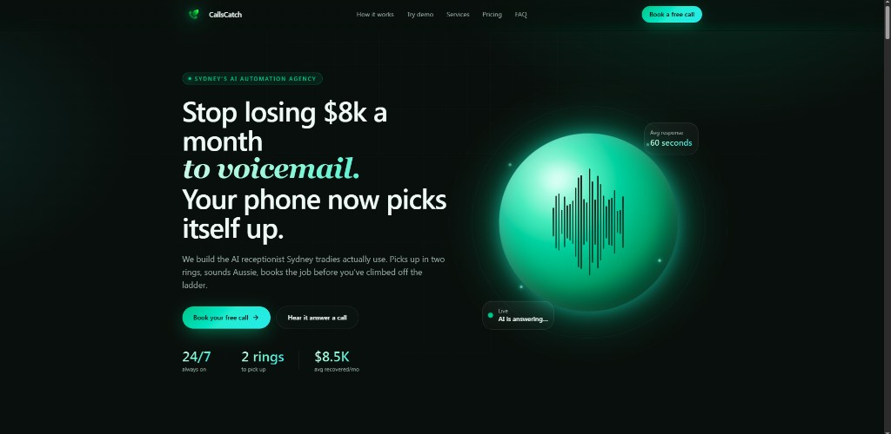

# CallsCatch — Portfolio Overview

**AI voice & automation agency** for Australian SMBs: Retell AI voice agents, n8n workflows, and Twilio telephony for lead capture and appointment flows.

> **Public portfolio repo** — production integrations and credentials remain in a **private** repository.

## Live site

**https://callscatch.com**

## Screenshots

| Marketing site (live) |
|:---:|
|  |

*Live site: [callscatch.com](https://callscatch.com)*

## Role

Founder · AI Engineer — agent design, orchestration, and production pipeline ownership.

## Stack

| Layer | Technologies |
|--------|----------------|
| Voice AI | Retell AI |
| Orchestration | n8n |
| Telephony | Twilio |
| Web | Marketing / landing site |

## Highlights

- Stateful LLM voice conversations and missed-call routing
- Latency-optimized SMS and voice automations
- Lead capture, review requests, and appointment reminders

## Architecture

See [docs/architecture.md](docs/architecture.md).

## Author

**Habib Khan** · [LinkedIn](https://www.linkedin.com/in/habib-khan-chan/)
